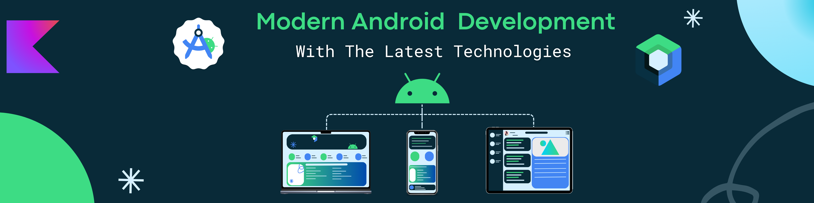

# Hi there 👋 I'm Mohammed 

  

    
    &nbsp;&nbsp;
    
    &nbsp;&nbsp;
    
    &nbsp;&nbsp;
    
  

## 🚀 My Story

From my first "Hello, World!" to building innovative solutions, my journey in tech has always been about curiosity, creativity, and connection. I love weaving code into stories that solve problems and inspire others. My mission? To make technology accessible, expressive, and impactful for everyone.

---

## 🛠️ Technical Arsenal

### 📱 Mobile Development

    
    
    

### 💻 Languages

    
    

### 🏗️ Architecture & Patterns

    
    
    

### 🔧 Development Tools

    
    
    
    

### 🧪 Testing

    
    

### 🛠️ Tools & Others

    
    
    

---

## 📝 Latest Blog Posts

<table>
  <tr>
    <td width="33%" align="center">
      <a href="https://dev.to/YourUsername">
        
         
        <b>Technical Deep Dives</b>
      </a>
    </td>
    <td width="33%" align="center">
      <a href="https://medium.com/@YourUsername">
        
         
        <b>Industry Insights</b>
      </a>
    </td>
    <td width="33%" align="center">
      <a href="https://hashnode.com/@YourUsername">
        
         
        <b>Tutorial Series</b>
      </a>
    </td>
  </tr>
</table>

---

## 🏆 Featured Projects

<table>
  <tr>
    <td width="50%">
      <h3 align="center">Project 1</h3>
      

        
        
<strong>Technologies:</strong> Kotlin, Jetpack Compose, MVVM

        
Brief description of the project and its impact.

      

    </td>
    <td width="50%">
      <h3 align="center">Project 2</h3>
      

        
        
<strong>Technologies:</strong> Android SDK, Firebase, KMM

        
Brief description of the project and its impact.

      

    </td>
  </tr>
</table>

---

## 🏅 Certifications & Achievements

<table>
  <tr>
    <td align="center">
      
       
      <b>Android Developer Certification</b>
       
      Google
    </td>
    <td align="center">
      
       
      <b>Kotlin Developer Expert</b>
       
      JetBrains
    </td>
    <td align="center">
      
       
      <b>Firebase Certification</b>
       
      Google
    </td>
  </tr>
</table>

---

## 📬 Let's Connect!

<table>
  <tr>
    <td align="center">
      
    </td>
    <td align="center">
      
    </td>
    <td align="center">
      
    </td>
    <td align="center">
      
    </td>
  </tr>
</table>

<i>💡 Open for exciting Android development opportunities and collaborations!</i>

---

  

